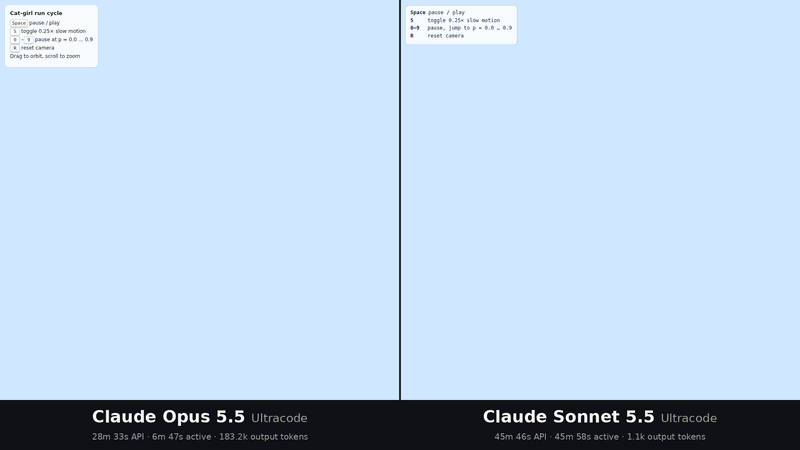
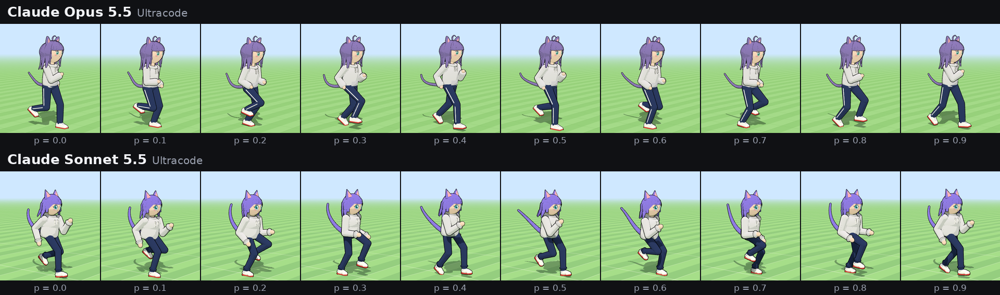

# Same prompt. One shot each. Claude Opus 5.5 vs Claude Sonnet 5.5.

*By [@NegevTV_](https://x.com/NegevTV_) on X · Round 2. Round 1 was [Grok 4.7 vs Opus 5.5](https://github.com/negevtvx/grok-vs-opus-catgirl-run).*



Round 1 was a bloodbath, so this time it's a family fight: big sibling vs little sibling. Both got the exact same (long, annoyingly specific) prompt: **build a 3D anime cat-girl from scratch and make her run in a perfect loop, all in one HTML file.** No 3D models, no textures, no images. Just code and math.

One prompt each, both on Ultracode. No retries, no edits, nobody holding their hand.

**Left:** Claude Opus 5.5. **Right:** Claude Sonnet 5.5.

This one's actually close, so look closely before you pick a side.

### ▶ [Play with both live, side by side](https://negevtvx.github.io/opus-vs-sonnet-catgirl-run/)

It runs right in your browser, nothing to install. Click a side, then hit <kbd>Space</kbd>, <kbd>S</kbd>, <kbd>0</kbd>–<kbd>9</kbd> or <kbd>R</kbd>. The keys fire on both sides at once. Drag to spin the camera, scroll to zoom.

Or open them one at a time: [Opus 5.5](https://negevtvx.github.io/opus-vs-sonnet-catgirl-run/outputs/claude-opus-5.5-ultracode.html) · [Sonnet 5.5](https://negevtvx.github.io/opus-vs-sonnet-catgirl-run/outputs/claude-sonnet-5.5-ultracode.html)

---

## Time and tokens

The big one isn't how they look. It's how much time and how many tokens each one burned.

| | Claude Opus 5.5 | Claude Sonnet 5.5 |
|---|---|---|
| API time | 28m 33s | 45m 46s |
| Active time | 6m 47s | 45m 58s |
| Input tokens | 78 | 48 |
| Output tokens | 183.2k | 1.1k |
| Cache read | 8.2M | 4M |
| Cache write | 271.7k | 175.8k |
| Cache hit rate | 97% | 96% |

These numbers come straight from the Claude app's session panel for each run. Sonnet's session also used the built-in browser tool.

## "You cherry-picked." No I didn't. Receipts:

- **The exact prompt:** [`prompt.txt`](prompt.txt), word for word. It's the same prompt as Round 1.
- **Both raw outputs:** [`outputs/`](outputs). The files are byte for byte what each model produced. I only renamed them.
- **SHA-256 hashes** are at the bottom, so you can check I didn't touch shit.
- **The side-by-side video** ([`media/side-by-side.mp4`](media/side-by-side.mp4)) was recorded with identical inputs hitting both pages on the same frames. Same slow-mo, same pause, same camera drags, same zoom, same everything.

Don't trust me. Download the files and run them yourself.

## Stuff worth noticing

- **They both picked lavender.** The prompt has a `{{HAIR_COLOR}}` placeholder that never got filled in. Both caught it and both went purple: Opus `#8e7cc3`, Sonnet `#8f7cf0`. Same family, same taste.
- **The hair.** Opus uses tapered spline-tube clumps plus an ahoge. Sonnet uses lathe-shaped clumps, and its back hair has two segments per clump, so the tips swing separately from the roots.
- **The face.** Both painted the face onto the head with a canvas texture. Opus wraps it around the whole head. Sonnet puts it on a separate curved patch in front.
- **The small stuff.** Opus added side stripes on the pants and "sleeve paws." Sonnet stopped the camera from going under the ground and darkened alternate hair clumps for depth.
- **The gait.** Opus keeps each foot planted for 36% of the stride, Sonnet for 40%. Both have a proper flight phase where both feet are off the ground.
- **Both files run with zero console errors.**

## Facts, no vibes

| | Claude Opus 5.5 | Claude Sonnet 5.5 |
|---|---|---|
| File size | 42,210 bytes, 770 lines | 27,483 bytes, 462 lines |
| Console errors or warnings (headless Chromium) | 0 | 0 |
| Hair color picked for `{{HAIR_COLOR}}` | `#8e7cc3` lavender | `#8f7cf0` lavender-violet |
| Hair pieces | 19 spline-tube clumps (ahoge included) + 2 scalp caps | 16 clumps (7 of them in two segments) + 1 scalp cap |
| Tail segments | 12 | 12 |
| Camera damping | off | off |



<details>
<summary>How the video was recorded (for the nerds)</summary>

- Both pages ran in headless Chromium at 960×960 on Playwright's fake clock. Time moved forward in exact 1/60 s steps, with one frame captured per step. That keeps the two halves in sync to within a frame or two. The only slack is exactly when an input event lands relative to each page's animation frame.
- Every key press, mouse drag and scroll came from one script and hit both pages on the same frame. It's the same input script as Round 1, so the Opus half is identical to that video.
- WebGL was software-rendered (SwiftShader) because the capture box had no GPU. On a real GPU both look a bit crisper.
- Three.js was served locally from the official `r160` tag of the three.js repo. That's the same release the import map points to.
- Yes, Claude helped put this repo together (the recording script, this README and the side-by-side page). Yes, the Claude that helped is literally one of the contestants, which is exactly why the raw files and hashes are right here. The two model outputs themselves are untouched.

</details>

## Hashes

```
9339d917fd8bc502dd1b50114ae9115ae8fdc92acaf811e0a82384ffb16bb7bf  outputs/claude-opus-5.5-ultracode.html
e0f2d2ad13ab671721511cd5184d3aaa6de2a57d52568e6b8cde15e5ba8bbb31  outputs/claude-sonnet-5.5-ultracode.html
c20bb0d0aaf1a554a41f27b8f818b6ef139e5cb104e1829459bd20bb0ec14ae3  prompt.txt
```

---

If this made you laugh, drop a star. Want Round 3 with a different prompt or other models? Open an issue, or yell at me on X: **[@NegevTV_](https://x.com/NegevTV_)**.
